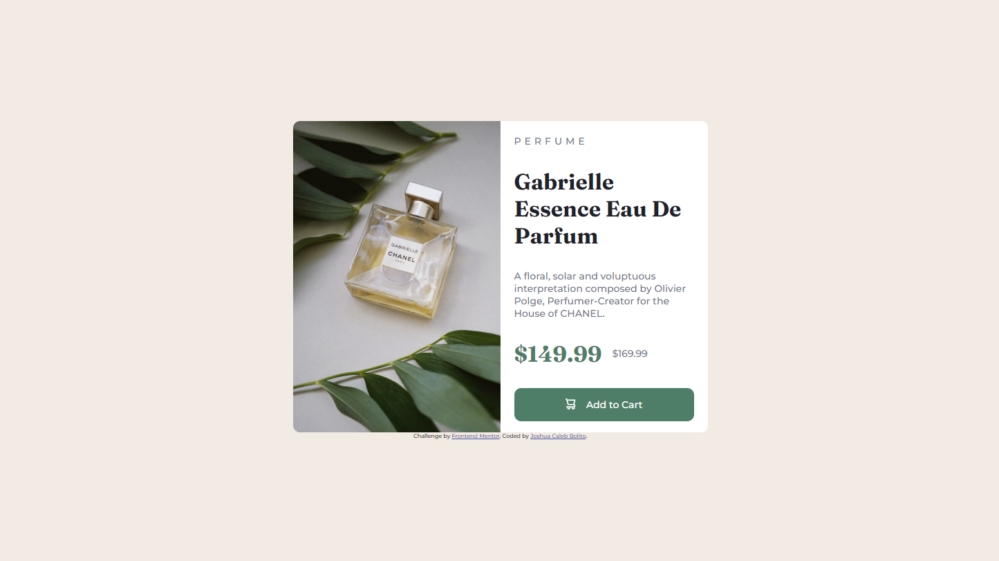
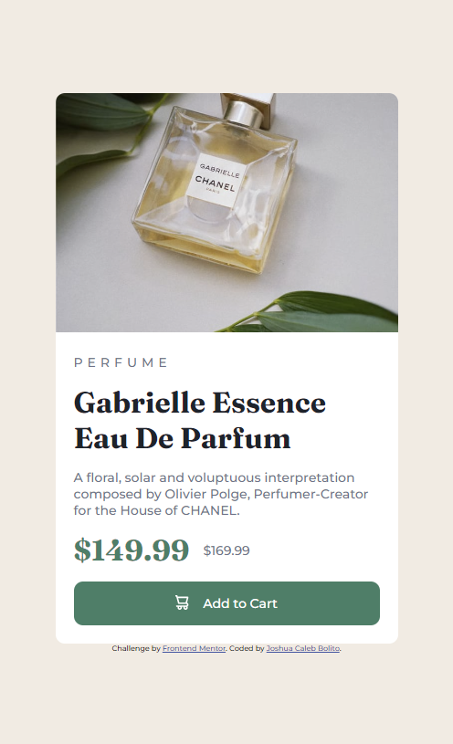

# Frontend Mentor - Product preview card component solution

This is a solution to the [Product preview card component challenge on Frontend Mentor](https://www.frontendmentor.io/challenges/product-preview-card-component-GO7UmttRfa). Frontend Mentor challenges help you improve your coding skills by building realistic projects. 

## Table of contents

- [Overview](#overview)
  - [The challenge](#the-challenge)
  - [Screenshot](#screenshot)
  - [Links](#links)
- [My process](#my-process)
  - [Built with](#built-with)
  - [What I learned](#what-i-learned)
  - [Continued development](#continued-development)
- [Author](#author)


## Overview
- This mini-project involves the creation of a responsive product preview card component using plain HTML and CSS. 
### The challenge

Users should be able to:

- View the optimal layout depending on their device's screen size
- See hover and focus states for interactive elements

### Screenshot





### Links

- Solution URL: [GitHub Repository](https://github.com/JCBolito/FM-Product_Preview_Card_Component_Main/)
- Live Site URL: [GitHub Pages](https://jcbolito.github.io/FM-Product_Preview_Card_Component_Main//)

## My process
Breaking down the project into smaller chunks, the following process were taken to guarantee the project's completion:
1. Structure the HTML.
1. Using a mobile-first approach, design the web page using CSS.
1. After completing the mobile design, proceed in creating the desktop design using media queries.

### Built with

- Semantic HTML5 markup
- CSS custom properties
- Flexbox
- Mobile-first workflow


### What I learned

Upon completing this project, I was immersed with the Mobile-first approach Workflow for the first time. Normally, I would do Desktop-first approach, but since the guidelines for this project required the use of Mobile-first approach, I went along with it.  

I also got to write Media Queries by myself after a long time of not having to, as the project required image adjustments depending on the screen size.

I used the following media query to hide the image dedicated for desktops when the current device resolution is less than 1440px wide:

```css
@media screen and (max-width: 650px) {
	.desktopImage {
		display: none;
	}
}
```

And, I used the following media query to adjust the contents of the webpage accordingly when the device resolution is 1441px wide and above or when the device resolution is the same as that of desktop or laptop monitors.

```css
@media screen and (min-width: 651px) {
	.mobileImage {
		display: none;
	}

	.desktopImage {
		max-width: 300px;
		border-radius: 10px 0 0 10px;
	}

	.card {
		display: flex;
		min-width: 600px;
		max-height: 450px;
	}

	h1,
	p {
		margin-bottom: 30px;
	}
}
```

### Continued development

Although I am satisfied with my final output on this project, I feel like I still need to polish my responsive CSS techniques, specifically in using Media Queries. I will try to improve my code for this project once I learn more about Media Queries on my learning journey using [The Odin Project](https://www.theodinproject.com/).


## Author

- Website - [Joshua Caleb Bolito](https://github.com/JCBolito)
- Frontend Mentor - [@JCBolito](https://www.frontendmentor.io/profile/JCBolito)
